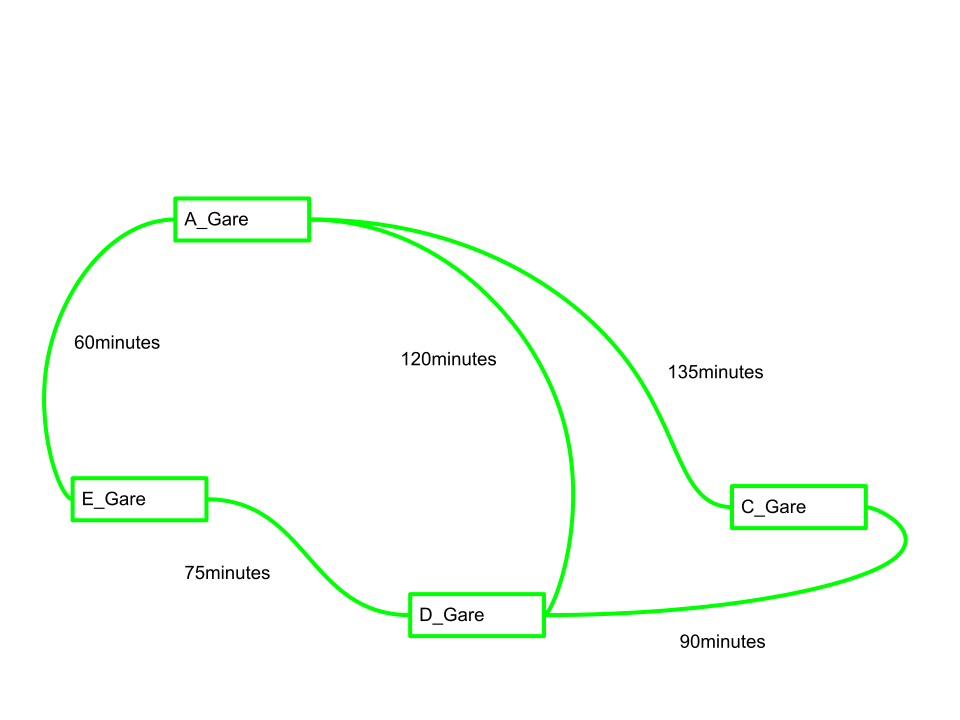
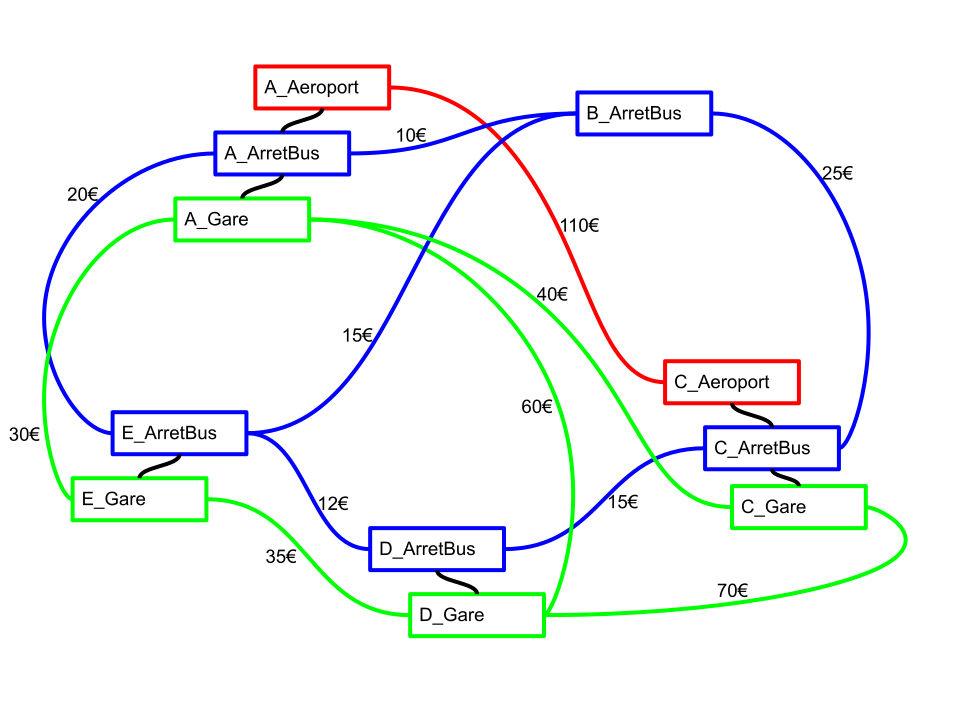

= Rapport SAÉ 2.01-2.02, ressource Graphes
Équipe B5

== 1. Version 1 : Un seul moyen de transport

=== 1.1 Exemple

Nous utilisons un réseau de transport entre 5 villes (A, B, C, D, E) utilisant les trois modes de transport suivant: Train, Avion, Bus.

.Tableau des connexions inter-villes
[options="header"]
|===
| type ligne | villes reliées | durée (min) | émissions (kg CO2e) | prix (€)
| avion | A, C | 135 | 120 | 110
| train | A, C | 60 | 3 | 40
| train | A, D | 120 | 8 | 60
| train | A, E | 60 | 4 | 30
| train | C, D | 90 | 4 | 70
| train | D, E | 75 | 5 | 35
| bus | A, B | 40 | 6 | 10
| bus | A, E | 100 | 15 | 20
| bus | B, C | 130 | 20 | 25
| bus | B, E | 80 | 12 | 15
| bus | C, D | 65 | 10 | 15
| bus | D, E | 60 | 9 | 12
|===

*Scénario Version 1 :*

* **Moyen de transport choisi :** Train
* **Critère d'optimisation :** Temps (Durée)
* **Ville de départ :** A
* **Ville d'arrivée :** D

*Les meilleurs itinéraires (Train uniquement, optimisation Temps) :*

1. [A, D] - Durée : 120 min
2. [A, E, D] - Durée : 60 + 75 = 135 min
3. [A, C, D] - Durée : 60 + 90 = 150 min

=== 1.2 Modèle pour l'exemple

Voici le graphe modélisant le scénario ci-dessus.

Les meilleurs itinéraires sous forme de chemins dans ce graphe sont:

* Chemin 1 : [A, D]
* Chemin 2 : [A, E], [E, D]
* Chemin 3 : [A, C], [C, D]

=== 1.3 Modélisation pour la Version 1 dans le cas général

Pour un problème de recherche d'itinéraire abstrait, voici comment nous définissons le modèle :

* **Type de graphe :** Conceptuellement, le réseau physique est non-orienté puisque les moyens de transport circulent dans les deux sens. Cependant, la librairie Java fournie pour ce projet imposant l'utilisation de graphes orientés, nous modélisons chaque tronçon physique par deux arêtes orientées (une pour l'aller, une pour le retour). Pour la Version 1, nous filtrons les données pour obtenir un graphe simple, orienté et valué.
* **Sommets du graphe :** L'ensemble des gares, arrêts de bus ou aéroports (selon le moyen de transport choisi) présents dans les villes.
* **Arêtes et poids :** Il existe une arête dirigée du sommet x au sommet y s'il existe une connexion directe avec le moyen de transport choisi entre ces deux infrastructures. Le poids de l'arête correspond à la valeur du critère d'optimisation (durée, émissions ou prix) de cette connexion.
* **Algorithme :** Nous utilisons l'algorithme des "k plus courts chemins" (kpcc). Ses arguments sont: le graphe généré G, le sommet de départ, le sommet d'arrivée, et le nombre k (ici k=4) d'itinéraires demandés.

=== 1.4 Prototype pour la Version 1

Le code source de la classe exécutable `GraphesV1` est disponible sur notre dépôt GitLab.

[source,java]
----
RÉSULTATS VERSION 1 : RECHERCHE D'ITINÉRAIRES (TRAIN UNIQUEMENT)
Recherche des meilleurs chemins de A_Gare à D_Gare :

1) Itinéraire : A_Gare -> D_Gare | Durée totale : 120 minutes
2) Itinéraire : A_Gare -> E_Gare -> D_Gare | Durée totale : 135 minutes
3) Itinéraire : A_Gare -> C_Gare -> D_Gare | Durée totale : 150 minutes
----

* **Lien du commit :** `https://gitlab.univ-lille.fr/sae2.01-2.02/2026/B5/-/commit/b23a0910bdf91346b3b432b1e4f4a0d2264085a5`

== 2. Version 2 : Plusieurs moyens de transport

=== 2.1 Exemple

Nous réutilisons l'exemple précédent avec l'ensemble des moyens de transport disponibles (Train, Avion, Bus).

.Tableau des correspondances intra-villes
[options="header"]
|===
| ville | moyens de transport reliés | durée (min) | prix (€)
| A | Aéroport - Arrêt de bus | 30 | 0
| A | Arrêt de bus - Gare | 15 | 0
| C | Aéroport - Arrêt de bus | 40 | 0
| C | Arrêt de bus - Gare | 15 | 0
| D | Arrêt de bus - Gare | 20 | 0
| E | Arrêt de bus - Gare | 15 | 0
|===

*Note : Dans le cadre d'une optimisation par le prix, nous considérons que les transferts à pied ont un coût de 0 €.*

*Scénario Version 2 :*

* **Critère d'optimisation :** Prix (Coût en euros)
* **Ville de départ :** D
* **Ville d'arrivée :** A

*Les 4 meilleurs itinéraires (Optimisation Prix) :*

1. [Bus uniquement] D_ArretBus -> E_ArretBus -> A_ArretBus
   - Prix : 12 + 20 = 32 €
2. [Bus uniquement] D_ArretBus -> E_ArretBus -> B_ArretBus -> A_ArretBus
   - Prix : 12 + 15 + 10 = 37 €
3. [Mixte Bus+Train] D_ArretBus -> E_ArretBus -> (Correspondance) -> E_Gare -> A_Gare -> (Correspondance) -> A_ArretBus
   - Prix : 12 + 0 + 30 + 0 = 42 €
4. [Bus uniquement] D_ArretBus -> C_ArretBus -> B_ArretBus -> A_ArretBus
   - Prix : 15 + 25 + 10 = 50 €

=== 2.2 Modèle pour l'exemple

Voici le graphe complet modélisant le réseau avec tous les moyens de transport et les correspondances intra-villes.

=== 2.3 Modélisation pour la Version 2 dans le cas général

Pour prendre en compte plusieurs modes de transport et leurs correspondances, le modèle évolue :

* **Type de graphe :** Conceptuellement, le réseau physique est non-orienté puisque les moyens de transport circulent dans les deux sens. Cependant, la librairie Java fournie pour ce projet imposant l'utilisation de graphes orientés, nous modélisons chaque tronçon physique par deux arêtes orientées (une pour l'aller, une pour le retour). Pour la Version 1, nous filtrons les données pour obtenir un graphe simple, orienté et valué.
* **Sommets du graphe :** L'ensemble de toutes les infrastructures de toutes les villes (par exemple, A_Gare, A_Aeroport, etc.).
* **Arêtes et poids :** Il existe deux catégories d'arêtes :
  ** *Les connexions inter-villes :* Relient des infrastructures de même type entre deux villes (ex: D_Gare vers E_Gare). Le poids est le prix en euros de la connexion.
  ** *Les correspondances intra-villes :* Relient des infrastructures différentes au sein d'une même ville (ex: E_ArretBus vers E_Gare). Puisque notre critère est le prix, le poids de ces arêtes est de 0 €.
* **Algorithme :** Nous utilisons l'algorithme des k plus courts chemins (kpcc) avec k=4. L'algorithme traverse les arêtes de correspondance exactement comme les arêtes de trajet, calculant ainsi le coût total du voyage.

=== 2.4 Prototype pour la Version 2

Le code source de la classe exécutable `GraphesV2` est disponible sur notre dépôt GitLab.

[source,java]
----
RÉSULTATS VERSION 2 : RECHERCHE MULTIMODALE
Critère d'optimisation : PRIX le moins cher
Recherche des meilleurs chemins de D_ArretBus à A_ArretBus :

1) Itinéraire : D_ArretBus -> E_ArretBus -> A_ArretBus | Prix total : 32 €
2) Itinéraire : D_ArretBus -> E_ArretBus -> B_ArretBus -> A_ArretBus | Prix total : 37 €
3) Itinéraire : D_ArretBus -> E_ArretBus -> E_Gare -> A_Gare -> A_ArretBus | Prix total : 42 €
4) Itinéraire : D_ArretBus -> C_ArretBus -> B_ArretBus -> A_ArretBus | Prix total : 50 €
----

* **Lien du commit :** https://gitlab.univ-lille.fr/sae2.01-2.02/2026/B5/-/commit/250a1138efa1a4bdf2741d59d643d191a14b5929
