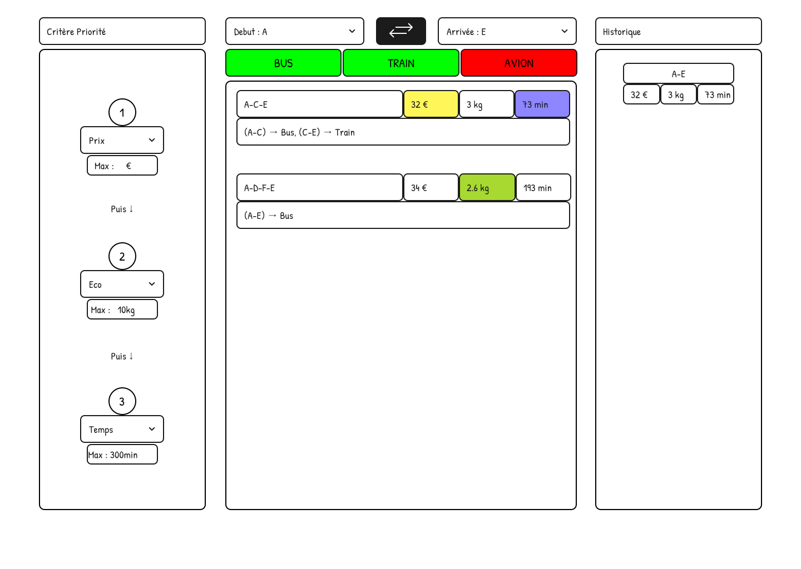

= Rapport IHM - SAÉ 2.01 & 2.02 : Comparaison d'itinéraires de transport
:toc: macro
:toc-title: Sommaire
:sectnums:

Équipe B5 :

* Romain LEFEBVRE
* Kylian PLANTARD
* Youssef CHEKALIL

toc::[]

<<<

== Explication de la SAÉ
Dans cette SAÉ, le but est de créer un assistant personnel de voyage. C'est un logiciel qui doit calculer, afficher et comparer des itinéraires sur un réseau de transport multimodal (avec des bus, des trains et des avions). Pour chaque trajet, on doit calculer un coût qui prend en compte le prix en euros, le temps en minutes et les émissions de gaz à effet de serre.

Pour la partie de l'IHM (Interface Humain-Machine), notre travail consiste à concevoir une interface claire pour que l'utilisateur puisse faire ses recherches facilement. L'application doit permettre de :

* Saisir une ville de départ et une ville d'arrivée sans faire d'erreur.
* Choisir ses préférences entre le prix, le temps et la pollution.
* Afficher les résultats des itinéraires de façon simple et compréhensible.
* Voir l'historique de ses anciens trajets.
* Proposer des éléments de "nudging" pour inciter l'utilisateur à choisir des trajets plus écologiques.

<<<

== Maquette basse fidélité
Dans cette partie, on présente nos choix de design, le fonctionnement général de l'application et à quoi elle va ressembler.

Pour le design, on a choisi de couper l'écran en trois grandes zones verticales. Cela permet à l'utilisateur de comprendre tout de suite comment interagir avec le logiciel sans être perdu.

Voici les explications détaillées de chaque partie de notre maquette :

* **La partie gauche (Priorités et Bornes) :** C'est ici que l'utilisateur choisit l'ordre de priorité de ses valeurs à optimiser (le prix, l'écologie ou le temps). Il peut aussi définir un maximum ou des bornes à ne pas dépasser pour ses critères (par exemple : pas plus de 10 kg de CO2 ou moins de 300 minutes).
* **La partie droite (Historique) :** Cette zone est dédiée à l'historique des choix de l'utilisateur pour qu'il puisse revoir ses anciens trajets.
* **La partie centrale (Recherche et Résultats) :** C'est le cœur de la page, elle est divisée en trois morceaux de haut en bas :
** *En haut :* La sélection de la ville de départ et de la ville d'arrivée, avec un bouton au milieu pour inverser facilement le sens du voyage.
** *Au milieu :* Les filtres pour activer ou désactiver les moyens de transport autorisés ou interdits (Bus, Train, Avion).
** *En bas :* La zone d'affichage des résultats obtenus. Si aucun trajet ne correspond, un message s'affiche pour conseiller à l'utilisateur de modifier ses filtres ou ses critères.

=== Lien vers la maquette interactive Figma
Pour tester les boutons et voir comment on passe d'un écran à l'autre en mode présentation, notre projet est disponible directement sur Figma:

* **Lien du prototype :** https://www.figma.com/design/3IvCsGe2PwgHD5a1Am4iZk/IHM?node-id=0-1&t=LqN4CF0COp3LK9jI-1[Cliquez ici pour ouvrir la maquette Figma]
_Note : Conformément aux consignes, le lien est partagé en mode lecture seule._

<<<

== Maquette haute fidélité

<<<

== JavaFX
