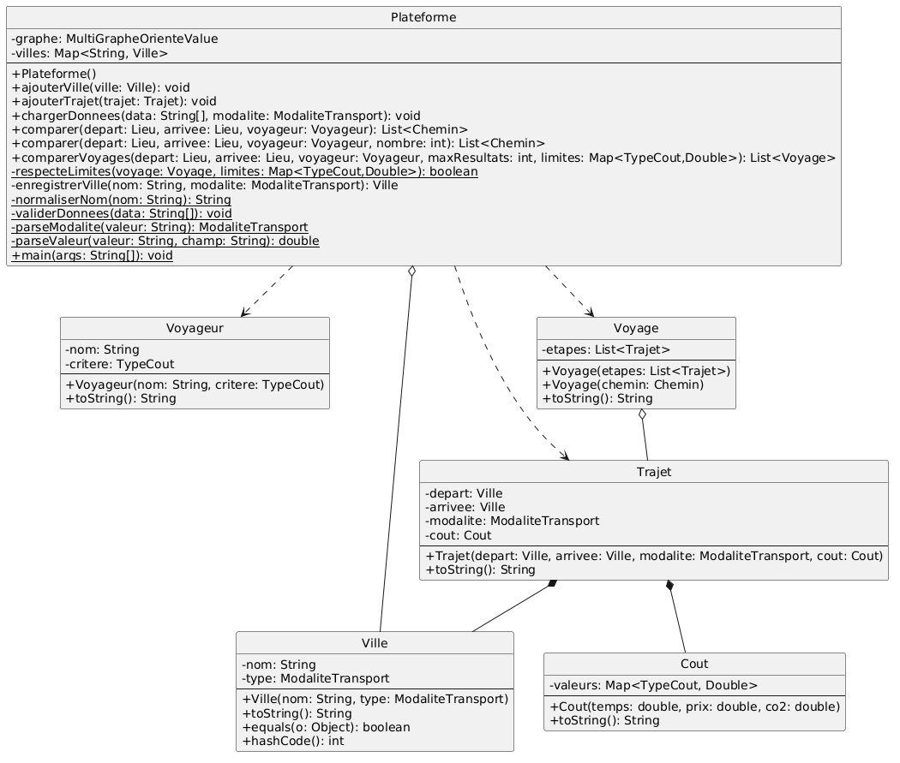
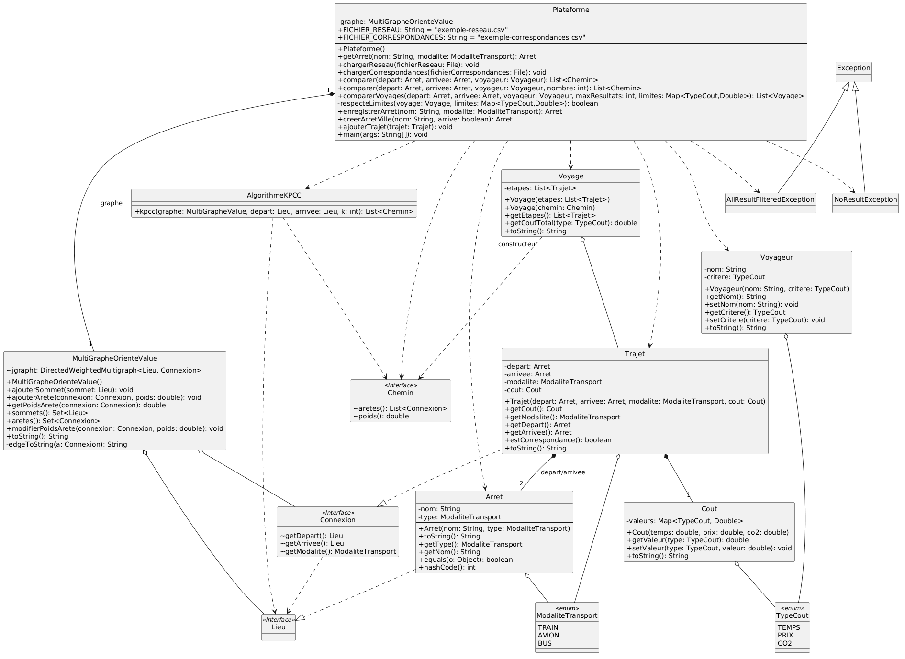

= Rapport POO - Versions 1 et 2
:toc:
:toc-title: Sommaire

== Rapport POO - Version 1

=== 1. Lancement et utilisation de l'application

Pour lancer cette première version du programme, il est nécessaire de compiler l'ensemble des classes Java puis d'exécuter la classe principale `Plateforme`. Les données initiales de la Version 1 sont intégrées sous la forme d'un tableau de chaînes de caractères (`String[]`) directement dans le code source.

**Compilation des classes :**
[source,bash]
----
javac -cp "lib/*:bin" src/*.java -d bin 
----

**Exécution de la Plateforme :**
[source,bash]
----
java -cp "lib/*:bin" Plateforme
----

=== 2. Diagramme UML et réflexion sur les mécanismes objets

La conception de notre application repose sur les interfaces `Lieu` et `Connexion`, ainsi que sur l'énumération `ModaliteTransport` (contenant `TRAIN`, `AVION`, `BUS`) telles que définies dans le cahier des charges.

* **Modélisation des coûts :** Nous avons créé l'énumération `TypeCout` (`CO2`, `TEMPS`, `PRIX`) pour représenter les différents critères d'optimisation. Le coût d'une connexion est géré via la classe `Cout` qui encapsule une table associative (`Map<TypeCout, Double>`).
* **Entités principales :**
** `Voyageur` : Représente l'utilisateur, défini par son nom et un critère principal d'optimisation (`TypeCout`).
** `Ville` : Implémente l'interface `Lieu`.
** `Trajet` : Implémente l'interface `Connexion`.
** `Voyage` : Modélise un itinéraire complet constitué d'une suite de `Connexion`s.
** `Plateforme` : Centralise les lieux et les connexions, et fournit les méthodes pour comparer et filtrer les voyages.

=== 3. Analyse technique et critique de l'implémentation

* **Validation des données :** Lors du chargement du tableau de chaînes de caractères, l'application vérifie la validité des informations. Les données incomplètes ou contenant des valeurs négatives pour les coûts sont ignorées/gérées pour ne pas corrompre le graphe.
* **Filtrage unimodal :** Conformément à la Version 1, l'application filtre la liste des connexions pour ne conserver que celles correspondant au mode de transport souhaité par l'utilisateur (ex. uniquement `TRAIN`).
* **Exclusion par seuil :** Nous avons implémenté des méthodes permettant d'exclure les trajets dont les coûts dépassent les bornes fixées par l'utilisateur (par exemple, rejeter tout voyage dont la durée dépasse un certain seuil).
* **Tri des résultats :** Les itinéraires possibles sont récupérés et évalués en fonction du critère préférentiel de l'utilisateur (ex. minimisation du CO2) pour proposer la meilleure alternative.

=== 4. Analyse quantitative et qualitative des tests

Des classes de tests unitaires ont été développées (ex. `VilleTest`, `TrajetTest`, `VoyageTest`, `VoyageurTest`, `CoutTest`, `PlateformeTest`) pour garantir la fiabilité de notre code :
* **Couverture des entités :** Ces tests couvrent la création correcte des objets et le calcul exact des coûts cumulés pour un voyage.
* **Comportement attendu :** Les scénarios de tests vérifient que le système réagit correctement face à des requêtes spécifiques et s'assurent que le filtrage par modalité de transport s'opère correctement.
* Ces tests nous assurent une base solide pour pouvoir implémenter les versions suivantes (gestion des correspondances, sérialisation) sans risquer d'introduire des régressions sur la base du calcul unimodal.

== Rapport POO - Version 2

=== 1. Lancement et utilisation de l'application

Tout comme la version précédente, le lancement du programme nécessite de compiler les classes puis d'exécuter la classe `Plateforme`. Cependant, la Version 2 charge dynamiquement les données du réseau et des correspondances depuis des fichiers CSV externes (`exemple-reseau.csv` et `exemple-correspondances.csv`) placés à la racine du projet.

**Compilation des classes (avec inclusion des bibliothèques de graphes et de tests) :**
[source,bash]
----
javac -cp "lib/*:bin" src/*.java -d bin 
----

**Exécution de la classe Plateforme :**
[source,bash]
----
java -cp "lib/*:bin" Plateforme
----

=== 2. Diagramme UML et réflexion sur les mécanismes objets

Pour cette Version 2, une restructuration importante du modèle a été nécessaire pour gérer la multi-modalité et les correspondances :

* **Remplacement/Évolution vers `Arret` :** Pour gérer correctement les changements de transport, la notion abstraite de ville ne suffisait plus. Nous avons créé la classe `Arret` (implémentant `Lieu`), définie par un nom de ville ET une `ModaliteTransport`. Deux arrêts dans la même ville mais pour des transports différents sont traités comme des nœuds distincts dans le graphe.
* **Évolution de `Trajet` :** Un `Trajet` (implémentant `Connexion`) peut désormais représenter une correspondance intra-ville. Cela se traduit par une `ModaliteTransport` à `null` (vérifiable par la méthode `estCorrespondance()`).
* **Création d'Exceptions :** Ajout des classes `NoResultException` et `AllResultFilteredException` pour signaler spécifiquement la nature des problèmes rencontrés lors d'une recherche.

=== 3. Analyse technique et critique de l'implémentation

* **Importation des données CSV :** La classe `Plateforme` définit les constantes pour les fichiers CSV et permet d'instancier dynamiquement le `MultiGrapheOrienteValue` avec les bonnes arêtes.
* **Gestion robuste des cas d'échec :** Comme exigé, nous signalons les problèmes via un mécanisme d'exception. Dans `Plateforme.java`, la méthode de recherche lève une `NoResultException` si aucun chemin n'existe entre le départ et l'arrivée, et une `AllResultFilteredException` si des chemins existent mais qu'aucun ne respecte les limites fixées par l'utilisateur (par exemple, un `TEMPS <= 180`).
* **Filtrage de l'affichage (Points d'intérêt) :** L'affichage d'un voyage a été optimisé. La méthode `toString()` de la classe `Voyage` itère sur les étapes pour ne pas afficher chaque arrêt intermédiaire de la même ligne. Elle affiche le point de départ, signale explicitement les changements de modalité par la balise `[Changement]`, indique la nouvelle modalité adoptée, et affiche le point d'arrivée. Les correspondances parasites au début ou à la fin d'un chemin (issues de la modélisation du graphe) sont nettoyées dans le constructeur `Voyage(Chemin chemin)`.

=== 4. Analyse quantitative et qualitative des tests

Les tests ont été étendus pour couvrir ces nouvelles fonctionnalités (notamment les exceptions et l'affichage) :

* **Validation de la structure du graphe :** Les tests s'assurent que les méthodes `equals` et `hashCode` de `Arret` discriminent bien deux arrêts d'une même ville ayant des modes de transport différents, garantissant ainsi l'intégrité du graphe.
* **Tests des Exceptions :** Des scénarios ont été mis en place pour vérifier que l'algorithme lance bien une `NoResultException` pour des villes déconnectées, et une `AllResultFilteredException` quand on impose un seuil inatteignable (ex: prix <= 0€).
* **Vérification de l'affichage :** Des tests vérifient la sortie de la méthode `toString()` d'un `Voyage` simulé pour s'assurer que seuls les points d'intérêt (les gares de correspondance et l'arrivée finale) sont présents.
